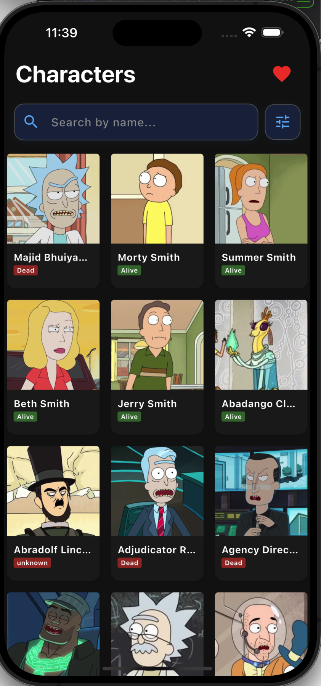
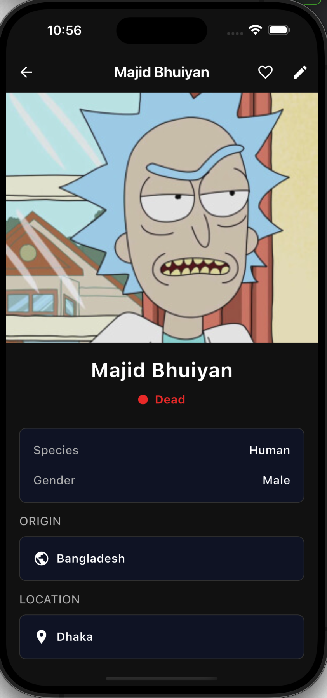
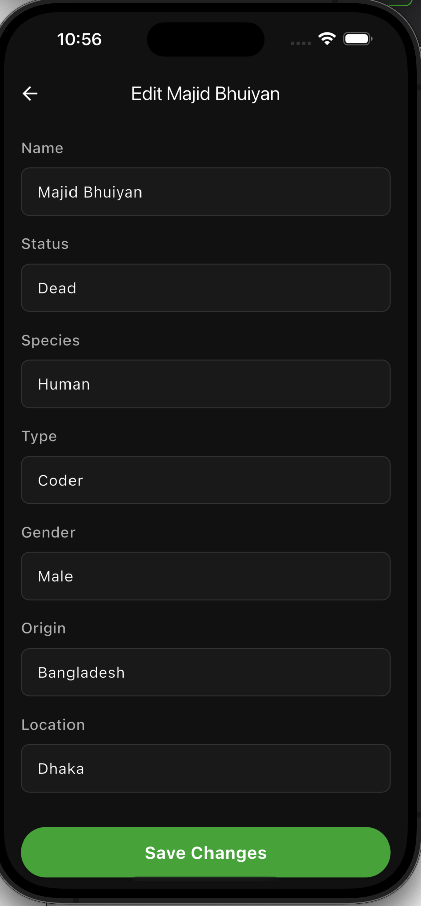

# 🎬 Rickpedia

> A comprehensive Flutter app to explore and manage Rick and Morty characters with advanced filtering, search, and local persistence capabilities.


## 📱 Overview

Rickpedia is a feature-rich mobile application built with Flutter that allows users to browse, search, filter, and manage their favorite Rick and Morty characters. The app demonstrates modern Flutter development practices with clean architecture, reactive state management, and efficient data persistence.

## ✨ Features Implemented

### 🔍 **Smart Search & Filtering**
- **Real-time Search**: Search through entire character database by name
- **Status Filter**: Filter characters by status (Alive, Dead, Unknown)
- **Species Filter**: Filter characters by species (9+ unique species)
- **Multi-filter Support**: Combine multiple filters simultaneously
- **Instant UI Updates**: Color-coded filter chips with instant visual feedback
- **Clear All**: Quick button to reset all filters at once

### 🎨 **Intuitive UI**
- **Collapsible Search Bar**: Search bar automatically hides when scrolling down, reappears on scroll up
- **Filter Panel Modal**: Bottom sheet modal with organized filter options
- **Responsive Grid**: 3-column character grid with dynamic spacing
- **Pull-to-Refresh**: Swipe from top to reload data from first page
- **Loading States**: Smooth loading indicators for better UX
- **Error Handling**: Graceful error messages with retry options

### 💾 **Data Management**
- **Local Caching**: All fetched characters automatically saved to Hive database
- **Offline Support**: View cached characters when internet unavailable
- **Pagination**: Infinite scroll pagination to load more characters
- **Data Merging**: User edits merged seamlessly with API data

### ❤️ **User Preferences**
- **Favorites**: Save and manage favorite characters locally
- **Character Editing**: Edit character information (custom notes/details)
- **Persistent Storage**: All edits and favorites saved locally
- **Quick Access**: View favorites in dedicated favorites screen

### 🎯 **Character Details**
- **Profile Cards**: Rich character information display
- **Character Details Page**: Comprehensive character information
- **Image Gallery**: Character avatar display
- **Episode Tracking**: View character episodes
- **Location Info**: Origin and current location details

---

## 📸 Screenshots

### Character List Screen
Browse and search through all Rick and Morty characters with advanced filtering capabilities.



### Character Details Screen
View complete character information including status, species, location, and episodes.



### Favorites Screen
Save and manage your favorite characters for quick access.


### Character Edit Screen
Edit and customize character information with persistent local storage.



---

## 🏗️ Architecture

### Clean Architecture with Riverpod

```
lib/
├── core/
│   ├── constants/          # App colors, API endpoints
│   ├── network/            # API client, exceptions
│   └── routes/             # Navigation setup
├── features/
│   ├── characters/
│   │   ├── data/
│   │   │   ├── models/     # Character model
│   │   │   └── repositories/ # Data layer
│   │   └── presentation/
│   │       ├── providers/  # Riverpod state management
│   │       ├── screens/    # UI screens
│   │       └── widgets/    # Reusable components
│   ├── favorites/          # Favorites feature
│   └── splash/             # App splash screen
└── main.dart               # App entry point
```

### State Management Flow

```
API Request
    ↓
CharacterRepository (Data Layer)
    ↓
characterListProvider (Pagination & Caching)
    ↓
mergedCharacterListProvider (Merge with Edits)
    ↓
filteredCharactersProvider (Apply Search & Filters)
    ↓
UI Renders (ConsumerWidget)
```

---

## 🔧 Technical Stack

### Why **Riverpod**?
- ✅ **Declarative State Management**: Easy to understand and maintain
- ✅ **Reactive Updates**: Automatic UI rebuilds when state changes
- ✅ **Type-Safe**: Full compile-time type checking
- ✅ **Testable**: Clean dependency injection
- ✅ **Lifecycle Management**: Automatic cleanup of resources
- ✅ **Provider Composition**: Combine providers easily for complex logic

### Why **Hive**?
- ✅ **Fast Local Persistence**: Lightning-fast reads/writes
- ✅ **No SQL**: Simple key-value storage
- ✅ **Type-Safe**: Strongly typed data models
- ✅ **Low Overhead**: Minimal dependencies
- ✅ **Offline Support**: Works perfectly without internet
- ✅ **No Configuration**: Zero-setup database

### Other Technologies
- **Flutter**: UI Framework for iOS/Android
- **flutter_screenutil**: Responsive design
- **dio**: HTTP client for API requests
- **hive**: Local database

---

## 📊 Filter System

### How Filtering Works

1. **Search Query Filter**
   - Searches character names in real-time
   - Case-insensitive matching
   - Searches entire dataset, not just loaded items

2. **Status Filter**
   - Alive, Dead, Unknown
   - Single selection (tap to select/deselect)
   - Visual blue highlight when selected

3. **Species Filter**
   - Human, Alien, Humanoid, Robot, etc.
   - Single selection mode
   - Visual purple highlight when selected

4. **Combined Filtering**
   - All filters work together
   - Order: Search → Status → Species
   - Results update instantly

### Filter Panel Features
- Bottom sheet modal interface
- "Clear All" button for quick reset
- Real-time visual feedback
- Responsive chip-based UI

---

## 🚀 Getting Started

### Prerequisites
- Flutter SDK (3.0+)
- Dart SDK
- iOS/Android development setup

### Installation

1. **Clone the repository**
   ```bash
   git clone https://github.com/yourusername/rickpedia.git
   cd rickpedia
   ```

2. **Install dependencies**
   ```bash
   flutter pub get
   ```

3. **Run the app**
   ```bash
   flutter run
   ```

---

## 📱 Features Walkthrough

### 1. **Character Browsing**
- Launch app and see paginated character grid
- Scroll down to load more characters automatically
- Each card shows character image and basic info

### 2. **Search**
- Tap search field to activate
- Type character name
- Results update in real-time
- Shows "No characters found" if no matches

### 3. **Filtering**
- Tap filter icon next to search bar
- Bottom sheet modal appears
- Select Status and/or Species filters
- Filters apply instantly
- Tap "Clear All" to reset

### 4. **Pull to Refresh**
- Swipe down from top
- Data reloads from page 1
- Cache cleared, fresh data fetched
- All changes saved locally

### 5. **Character Details**
- Tap any character card
- View full profile with all details
- Edit character information
- Add to favorites

### 6. **Favorites**
- Add/remove characters from favorites
- View favorites in dedicated screen
- Persistent across app restarts

---

## 💡 Key Implementation Details

### Smart Scrolling
- Search bar uses `SliverAppBar` with `floating: true` and `snap: true`
- Hides when scrolling down, reveals when scrolling up
- Part of `CustomScrollView` for smooth integration

### Infinite Pagination
- Listens to scroll position
- Triggers API call when reaching bottom
- Appends new characters to existing list
- Shows loading indicator during fetch

### Local Data Persistence
```dart
// Automatic saving on API response
await _saveCharactersLocally(characters);

// Fallback to cache if offline
return _getCachedCharacters();

// All edits saved to separate database
EditRepository.saveMergedCharacter(character);
```

### Reactive Filtering
```dart
// Search results update instantly
final filteredCharacters = ref.watch(
  filteredCharactersProvider(mergedCharacters),
);

// Rebuilds when filterState changes
final filterState = ref.watch(searchFilterProvider);
```

---

## 📦 Data Models

### Character Model
```dart
class Character {
  final int id;
  final String name;
  final String status;      // Alive, Dead, unknown
  final String species;
  final String gender;
  final String image;
  final Location origin;
  final Location location;
  final List<String> episodes;
  // ... additional fields
}
```

---

## 🔄 State Management Providers

| Provider | Purpose |
|----------|---------|
| `characterListProvider` | Fetches & paginates characters |
| `mergedCharacterListProvider` | Merges API data with user edits |
| `searchFilterProvider` | Manages search & filter state |
| `filteredCharactersProvider` | Applies filters to characters |
| `favoriteCharactersProvider` | Manages favorite characters |
| `editProvider` | Manages character edits |


---

## 👨‍💻 Development Notes

### Code Quality
- Clean Architecture principles
- SOLID design patterns
- Proper error handling
- Type-safe state management

### Performance Optimizations
- Lazy loading with pagination
- Efficient grid rendering with SliverGrid
- Minimal rebuilds with Riverpod
- Optimized image caching

---

**Built with ❤️ using Flutter & Riverpod**
